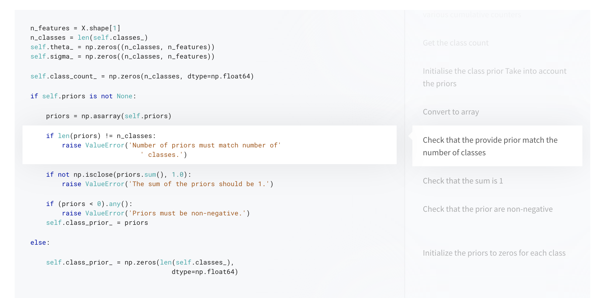

# Scrollable Python

Saw this page allennlp.org/tutorials from AllenNLP and I really liked it. So I asked the author for permission, visited their repos [here](https://github.com/allenai/allennlp-website) and [here](https://github.com/allenai/allennlp), and repurposed it a little to make it more usable.

Here's a preview:



## Quick start

1. Clone this repo and `cd` into it.

2. Make sure you have Ruby installed (Ruby can be installed [here](https://jekyllrb.com/docs/installation/)). Using Ruby's package manager, install `jekyll` and `bundler`.

    ```bash
    gem install jekyll bundler
    ```

3. Run the Python parser on `your_python_file.py` (which is a sample I put up here).

    ```bash
    python parser.py your_python_file.py
    ```

    This produces `index.html`. We're not quite done yet.

4. Run the Jekyll server.

    ```bash
    bundle exec jekyll serve
    ```

    Now browse to http://localhost:4000.

## How does it work?

To create a scrollable Python tutorial, firstly, we use a parser (modified from [here](https://github.com/allenai/allennlp/blob/master/tutorials/tagger/convert.py)) on the target Python script. This generates an HTML file with some template tags like ``. Then, using kramdown and Jekyll as the static site generator, we produce the final output `index.html`.

## Syntax

Ensure that what you want to appear as Markdown be commented with double hashes `##` and placed at the top of every code paragraph.

## Use cases

* Works well for **scripts**.
* Useful for tutorials where a lot of explanation is needed.
